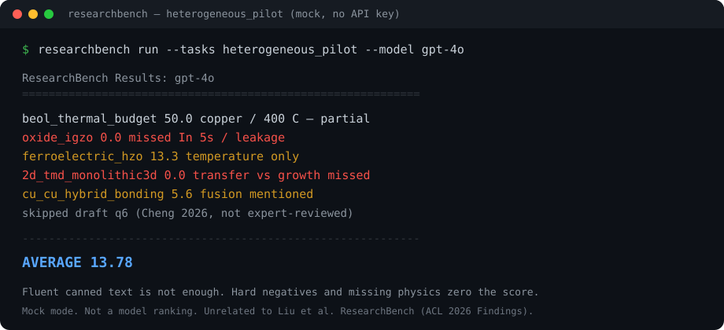

# ResearchBench

**Run a BEOL / heterogeneous-integration quiz on any chat model, in your terminal, with no API key.**


[](https://mybinder.org/v2/gh/CAOShurong/researchbench/master?urlpath=lab/tree/examples/demo.ipynb)


<p align="center">
  
</p>

```bash
pip install "git+https://github.com/CAOShurong/researchbench.git@v0.4.1"
researchbench run --tasks heterogeneous_pilot --model gpt-4o
```

No browser install: [launch the same mock-mode demo on Binder](https://mybinder.org/v2/gh/CAOShurong/researchbench/master?urlpath=lab/tree/examples/demo.ipynb).

No key → mock mode (smoke test). With a key → real answers, scored by a coded
rubric (thermal budget, IGZO, HZO, 2D transfer vs growth, Cu–Cu hybrid bonding).
Wrong-but-fluent answers that trip hard negatives lose points.

```text
ResearchBench Results: gpt-4o
============================================================
  heterogeneous_pilot      :  13.78
------------------------------------------------------------
  AVERAGE                  :  13.78
```

That 13.78 is **mock-mode** with no API key (one canned paragraph, five rubric
items). It is not a model ranking.

> Unrelated to Liu et al. *ResearchBench* (ACL 2026 Findings). This repo is an
> **evaluation-framework prototype**, not a validated leaderboard.

## What you can inspect

| You run | You get |
|---|---|
| `researchbench run --tasks heterogeneous_pilot` | Rubric scores + per-criterion evidence for 5 BEOL items |
| `researchbench run --tasks heterogeneous_pilot --allow-draft` | Also includes draft item q6 (2026 paper, not expert-reviewed) |
| `researchbench list` | 8 tasks. Seven are keyword-matching **placeholders** and must not be quoted as model quality. |

The question this harness is built to answer later:

> Which AI is the better *research assistant* for electronic-engineering work,
> under what conditions, and how do we know?

It does **not** answer that yet. Do not cite current numbers as a ranking.

## Installation

```bash
pip install "git+https://github.com/CAOShurong/researchbench.git@v0.4.1"

# Local checkout:
pip install -e ".[judge]"   # optional OpenAI / Anthropic clients
```

## Quick Start

```python
from researchbench import Benchmark

bench = Benchmark(tasks=["heterogeneous_pilot"])
result = bench.run(model="gpt-4o")
print(result.summary())
```

CLI:

```bash
researchbench run --tasks paper_comprehension,idea_generation --model gpt-4o --allow-draft
researchbench run --tasks heterogeneous_pilot --model gpt-4o
researchbench run --tasks all --model gpt-4o --allow-draft --format json --save report.json
researchbench compare --model gpt-4o --model claude-3-opus --tasks all --allow-draft
```

> Without an API key, tasks run in **mock mode** and return canned scores for
> smoke testing only — they are not real model evaluations.

## Documentation

- [`RESEARCH_BENCHMARK.md`](RESEARCH_BENCHMARK.md) — **authoritative design
  document**: purpose, philosophy, capability taxonomy, validity requirements,
  evaluation protocol, reproducibility, comparison with existing benchmarks.
- [`docs/RESEARCH.md`](docs/RESEARCH.md) — background research and gap analysis.
- [`docs/USAGE.md`](docs/USAGE.md) — CLI and Python API reference.
- [`docs/LAUNCH.md`](docs/LAUNCH.md) — how this repo is meant to be found (Show HN text).
- [`docs/TASK_DEFINITIONS.md`](docs/TASK_DEFINITIONS.md) — task scoring formulas
  (note: these are placeholder mechanics, not validated evaluation).
- [`docs/CONTRIBUTING.md`](docs/CONTRIBUTING.md) — how to develop, test and extend.
- [`docs/FAQ.md`](docs/FAQ.md) — frequently asked questions.
- [`docs/ROADMAP.md`](docs/ROADMAP.md) — proposed direction.
- [`examples/`](examples/) — runnable demos (mock-mode safe).
- [`CHANGELOG.md`](CHANGELOG.md) — version history.

## Development

```bash
pip install -e ".[dev]"
ruff check src tests && ruff format --check src tests
mypy src
pytest tests -v
```

## License

MIT for code. Data follows source licenses (arXiv, OpenReview, etc.).